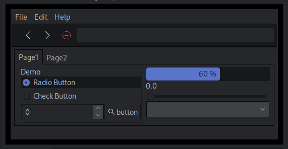

# GNU/Linux Configuration

## Table of contents
- [Linux packages](#linux-packages)
  - [Apt](#apt)
  - [Pacman](#pacman)
- [Server setup](#server-setup)
  - [Wireguard installation](#wireguard-installation)
  - [ICMP traffic](#icmp-traffic)
- [My config files](#my-config-files)
- [Global configs](#global-configs)
  - [Environment](#environment)
  - [Intel](#intel)
- [Theming](#theming)
  - [Icons](#icons)
  - [Theme](#theme)

### Linux packages
#### Apt

```
sudo apt update && sudo apt upgrade -y && sudo apt autoremove -y
sudo apt install -y curl tree zip git htop ncdu python3 neovim neofetch bash-completion
```

- **Wireguard** ```wireguard-dkms wireguard-tools linux-headers-$(uname -r)```
- **Servers** ```nginx certbot python3-certbot-nginx net-tools```
- **Pleroma** ```build-essential postgresql postgresql-contrib cmake libmagic-dev ffmpeg imagemagick libimage-exiftool-perl```
- **Virtual Machines** ```ssh spice-vdagent```

#### Pacman
For arch-based distros, I have my packages listed line-by-line:
[Link](https://codeberg.org/st/dots/src/branch/master/etc/pkg)

```
pacman -S $(echo packages.txt)
```

---
### Server setup

Linux kernel for **Debian**
```
sudo apt install linux-image-4.19.0-14 linux-headers-4.19.0-14-cloud-amd64
```

**Termite** terminfo
```
# On host
infocmp > termite.terminfo
scp termite.terminfo root@server:

# On server
tic -x termite.terminfo && rm termite.terminfo
```


#### Wireguard installation

```
curl -O https://raw.githubusercontent.com/angristan/wireguard-install/master/wireguard-install.sh
chmod +x wireguard-install.sh
./wireguard-install.sh
```

#### ICMP traffic

Add the following line to `/etc/ufw/before.rules`
```
-A ufw-before-input -p icmp —icmp-type echo-request -j DROP
```

### My config files

Do bare clone
```
$ git clone --bare https://codeberg.org/st/dots.git ~/.dotfiles
```
Create **config** alias
```
$ alias config='git --git-dir=$HOME.dotfiles/ --work-tree=$HOME'
$ config checkout
```

### Global configs

#### Environment
`/etc/environment`:
```
QT_QPA_PLATFORMTHEME=qt5ct
LANG=EN_US.UTF-8
LC_CTYPE=en_US.UTF-8
```

#### Intel
`/etc/X11/xorg.conf.d/20-intel.conf`:
```
Section "Device"
        Identifier  "Intel Graphics"
        Driver      "intel"
        Option      "AccelMethod"  "sna" # default
        Option	    "TearFree"		"true"
        
        # Option    "DRI" "2"
        # Option    "AccelMethod"  "uxa"
	# Option    "SwapbuffersWait"	"false"
EndSection
```

### Theming

#### Icons


#### Theme

[Github](https://github.com/vinceliuice/Qogir-theme)



Also, set theme of **qt5** to **gtk2** in **qt5ct**, to make it the same as gtk.


### New user

Create user home dir
```
mkdir -p /home/USER
```

Add user
```
useradd -d /home/USER USER -s /bin/bash
usermod -aG sudo USER
```

Set permissions
```
chmod 700 /home/USER/.ssh
chmod 644 /home/USER/.ssh/authorized_keys

chown -R USER:USER /home/USER/
```

Set password
```
passwd USER
```

To copy ssh private key,
On host machine do:
```
ssh-copy-id USER@111.99.33.111
```

