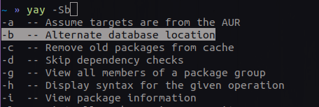

# GNU/Linux guide

## Table of contents

- [**Linux** - the right one.](#linux---the-right-one)
- [**Pacman** - most powerful package manager](#pacman)
    - [**AUR** - Arch User Repository](#aur)
- [**yay** - Yet Another Yogurt](#yay)
    * [Installation](#installation)
- [**zsh** - great alternative to bash](#zsh)
    - [Plugins](#plugins)
        - [zsh-autosuggestions](#zsh-autosuggestions)
        - [zsh-fast-syntax-highlightning](#zsh-fast-syntax-highlightning)
    - [Oh My Zsh](#oh-my-zsh)
- [~~vim~~]()
- [~~qtile~~]()
- [~~dunst~~]()
- [~~polybar~~]()

In this article, I'll try describe my most common used tools for everyday needs, 
that make my communication experience with **Linux** (Especially **Arch**) much better.

## Linux - the right one

- #### Debian
    You might take a look at *vanilla Debian*, but I didn't spend much time using it,
    **apt** is great, but after all, I prefer **rolling release** scheme

    Anyway, you might like it, as it is most **stable** among popular distributions.

    ##### Other Debian-based, but not exactly Debian
    Since I'm not a big fan of **\*Ubuntu**-based distributions,
    because of their dependence on **Cannonical**, and to be clear,
    for me, it's nothing more than just Debian with a bunch of *useless* apps, I'd rather configure it **myself**.

    But if you're new to GNU/Linux, you might find **Linux Mint** as a great start point
- #### Red Hat, Fedora
    Again, it's depends on big company, which is already red flag, I didn't even tryed it.

    All I know, is they invented their own package manager, package format, but what for?

- #### Gentoo
    This distribution philosophy stands for flexibility, that you can setup it on your own, and take full control of your installed packages

    By default in Gentoo the entire system is built from **source code**, so it will take you a lot of time,
    at least to compile big heavy desktop environment such as **Gnome**, **Kde**, **Xfce**.

    So, you're being forced to use only lightweight, open-source *everything*, from the terminal emulator to your browser.

    Great choise if you're *experienced* enough in terms of Linux, otherwise stick to some else distribution.
- ##### ~~Slackware~~
- #### Arch
    Unlike other distributions, installation process goes only through command line,
    so you have to be skilled enough in *GNU/Linux*, in order to install it.

    Also, it's really nice feature, that helps you understand better 
    how installation process really goes, how Linux really works, and makes your system really *yours*.

    Of course that doesn't belong to some kind of *Graphical installers*, as with them,
    you losing Arch main advantage - configure your computer *like you want*,
    only packages that *you want*, nothing extra, just that you really need.

    ##### Manjaro

    There are a lot of discussions about it, many even call it another, **pacman-based** distribuiton, 
    that doesn't belongs to **Arch** at all, and have it's own issues and own community.

    I think it is great option as **first distribution** comparing with many *Ubuntu* distributions,
    also, those, who intend to **play** on Linux, might, find it great, ready to start solution.

Well, next part will be suitable only for **Arch-based** distributions, you can skip it.

## pacman

**Archlinux** ships with **pacman**, a very powerful built-in package manager,
and in combination with **AUR** let you install almost **any** software you want, just sitting inside the **command line**

Here is some simple **cheat sheet** how to use pacman:

> **Update** system
> ~~~
> sudo pacman -Syu
> ~~~

> **Install** packages
> ~~~
> sudo pacman -S package_name
> ~~~

> Or with **packages.txt** file written line-by-line:
> ~~~
> sudo pacman -S $(cat packages.txt)
> ~~~

> **Delete** packages
> ~~~
> sudo pacman -R package_name
> ~~~

- ### AUR
    The Arch User Repository (AUR) is a **community-driven** repository for Arch users.

    In the AUR, users are able to **contribute** their own package builds. 
    The AUR community has the ability to vote for packages in the AUR. 
    If a package becomes popular enough — it may be entered into the community repository, and accessible directly by **pacman**.

## yay
*Yet Another Yogurt* - An **AUR** Helper Written in Go

Well, exactly it inteds to be **pacman replacement**, and does it well.
In other words, the **same** syntax can be used as with the *pacman*: `yay -S`, `yay -R`,
and all other keys used with pacman.

So, as said above, yay adds support to **AUR**, and you can easily install any AUR package, as it exists in main Archlinux repository:
~~~
yay -S package_name
~~~

Also you can drop that unnecessary `sudo`, as with pacman.

#### Installation
Since **yay** isn't provided by official **Arch** repository, you need to install it **manually**:
~~~
curl -s git.io/yay.sh | bash
~~~
## zsh
Is a shell designed for interactive use, it is also a powerful scripting language.

It's similar to **bash**, but offers more configurability, powerful command-line **completion**,
and can be extended with a big amount of different **pllugins**.

It can perform some nice stuff like that:

But that's not even it's main advantage, his **power** comes with a lot of plugins,
that provide really great experience.

#### Installation
The easiest way to get **zsh** is just install it via your distro package manager, like

`sudo apt install zsh`, `sudo pacman -S zsh`, or whatever you use.

And then, change your **default** shell using `chsh -s $(which zsh)`

### Plugins
There are two nice plugins, that i very recommend to use: 

- #### zsh-autosuggestions
    [Installation](https://github.com/zsh-users/zsh-autosuggestions/blob/master/INSTALL.md)

    

- #### zsh-fast-syntax-highlightning
    [Installation](https://github.com/zdharma/fast-syntax-highlighting)

    
    

#### oh-my-zsh
Worth mentioning about **Oh my zsh** - most popular zsh plugins **manager**.
It simplifies plugins management.
[Installation](https://github.com/ohmyzsh/ohmyzsh/wiki)
