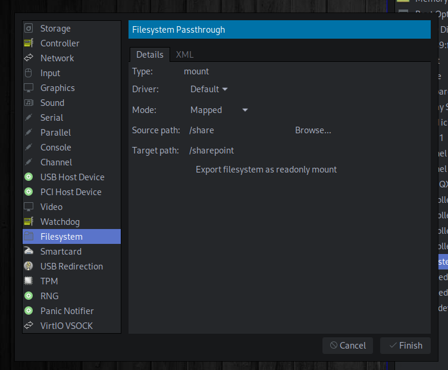

# How to set up shared folder in virt-manager

## Create ```/share``` folder

Create a future share folder on your host and set up the permissions:

```
# mkdir /share
# chmod 777 /share
```

## Setup virt-manager

**Attach the new filesystem in virt-manager image settings:**

1. View > Details
2. Add hardware > Filesystem
3. Switch mode to Mapped if you need to have write access from the guest
4. Confirm and start the VM again




### Setup the VM

Now you can mount your shared folder from the VM:

```
# mkdir /share
# mount -t 9p -o trans=virtio /sharepoint /share
```

To make changes permanent, add the following line to **```/etc/fstab```**
```
/sharepoint   /share    9p  trans=virtio,version=9p2000.L,rw    0   0
```
**That's all!**

### Related links
[How to set up shared folders in virt-manager](https://nts.strzibny.name/how-to-set-up-shared-folders-in-virt-manager/)
